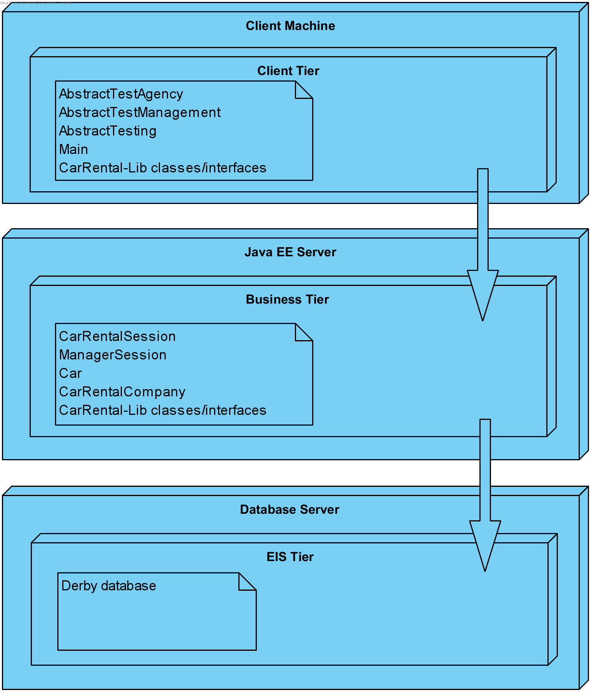

# Java JEE: Assignment 2 and 3
KULeuven Distributed Systems

**Overall score**: 18/20

**Year**: 2019-2020 Master of Science in the Applied Informatics

**Team**:
* [Dries Janse](https://github.com/r0627054)
* [Steven Ghekiere](https://github.com/StevenGhe)

# About
### Stateful and Stateless

Both the manager and client session beans are server-side (EJB) Enterprise Java Bean components. The component is a session bean, because it represents a session with the client. The
client session is a stateful session bean, this means that it retains state between method invocations.
The (conversational) state consists of the values of the instance variables. The client session is
stateful because it keeps the conversational state, it contains the name of the renter and the list of
quotes of this renter. The manager session is a stateless session bean, this means that it does not
retains the conversational state. In our application there is no need to make the manager session
stateful because all instances of the bean are equivalent. This allows the EJB container to assign
an instance to any manager.

### Dependency injection

The RMI registry of the RMI assignment is a simplified name service that allows clients to
get a reference to a remote object. The @EJB annotation can be applied on fields or methods
to inject dependencies. The EJB client container will first perform a JNDI lookup to locate the
dependency. JNDI stands for Java Naming and Directory Interface, it allows distributed application
to look up services in an abstract way. With JEE we don’t have to explicitly instantiate, with the
"new" keyword, the objects of which we need a reference. JEE provides these injection mechanisms.
We only have to declare the needed resources with the annotations (@EJB) that denotes the
injection point to the compiler. The container will then provide an instance of the required resource
at runtime. The advantage of using dependency injection is that it simplifies our code because the
container automatically provides these instances.

### JPQL persistence queries

JPQL uses the entity object model instead of querying actual tables in the database. This
makes it more easy for the Java developer. To answer the question; there are multiple advantages
of retrieving rental statistics without using application logic.

For example, retrieving the number of reservations made by a particular car renter. With only a
JPQL query, one number is returned. Only one number is send from the database server back to
the Jave EE Server. The JEE server then only has to create an integer and store the result. If we
used application logic to calculate the number of reservations for a particular car renter, we first
had to request all the reservations from the database. This results in a large amount of network
traffic between the database server and the Java EE Server. For each reservation an object is
created on the Java EE server, which results in a big memory usage. The application now has to
make operations on the list of reservations, which can take substantially longer than a database.
This is because the database can be indexed.

### Server crashes

The resilience against server crashes depends on which component crashes on which server. This is
because we are talking about a distributed application. In the Java RMI assignment all the car
rental companies store their data in memory. So if a server crashes which contains a car rental
company all the data is lost when the server reboots. If the server which contains the Naming
Service component crashes and reboots, all the car rental company references are lost, this is
because they are stored in memory. If the server with Rental Agency crashes and reboots all the
sessions are lost with the client.

The biggest difference with this assignment is that all the data is stored in a database. So if the
server crashes which contains the CarRentalSession and ManagerSession classes all the data will
not be lost. Only the data of the sessions will be lost because they are not persistent.

### Migration

The entities in the application are persisted in the same manner, the only change is the location and name of the database. The persistence unit (persistence.xml) stores all the information
needed for migrating to another data source. It stores information such as the data source, table
generation strategy, validation strategy, etc. We can specify that it automatically generates the
relations and the tables of the entities. For the actual migration to another database, the copying
of the data from one database to another, is done by the database administrators. They have to
set up a migration strategy for retrieving the database from the first database and inserting it into
the new database.

### Race conditions

The car rental session is a stateful session bean, this means that every user will get his own
session scoped instance. The next thread will wait until the first thread finishes. One user cannot
execute the same code in parallel, but different users can. The manager session is a stateless session
bean, this means that every thread will get a different instance of the EJB from the pool. The
same code can be executed in parallel.

Thread handling is done by EJB container. JSE level thread handling is discouraged to use by
the developer before JEE 7. This means that, for example, the use of the ’synchronized’ keyword
is discouraged.

In our solution we made use of a transaction for confirming the quotes of a particular car renter. If
not all the quotes could be confirmed than a roll back will happen and a reservation exception will
be thrown. This happens when multiple renters try to confirm their quotes at the same time. For
specifying the transaction we made use of the @TransactionAttribute annotation.

### Scalability

Transactions make sure the required data modifications are either all saved (committed) or
rolled back. If any of the statements fail of our transaction, the transaction will roll back and
all the statements are undone. Since the EJB container handles the rollback, we do not need
to implement the reverse operation. We only need to raise an exception or telling the container
explicitly that something went wrong.

Within Java RMI we cannot make use of the rollback functions and thus we needed to implement the rollback functionality ourselves.

Transactions are better scalable, different operations can be executed on different data sources in
parallel by different threads. This was not the case in the Java RMI assignment, we had to make
the method or list synchronized. This means that only one thread can access the resource at a time.
All other threads attempting to enter the synchronized block are blocked until the first thread
inside the block exits. This makes the Java RMI less scalable in comparison with transactions.

### ManagerSession

In our application we made use of the @RolesAllowed annotation. We specified the annotation at class level of the ManagerSession. By doing this it applies to all the methods in the class. In
this annotation we only putted the Manager role. So every person or group which has the manager
role assigned can use the methods. On out GlassFish server we created a couple of persons with
the manager role and we enabled the automatically mapping functionality. By doing this the users
have to provide their username and password before executing the manager methods.

### RMI JEE JSE

The answer on this question can be found in the introduction of the first JEE assignment. Java
EE is a middleware which adds services relevant for distributed systems to Java SE. It provides
services as transactions, persistence and session management. This allows the developer to cleanly
structure business logic, client interaction and back-end processing. If someone would develop an
enterprise-grade Java application, he would preferably use Java EE because it is a powerful model.
It is also involved into frameworks such as Hibernate and Spring. It wouldn’t be impossible to
create a similar application using Java SE, but it would require a lot more work and would be less
performant.

### Tiers

